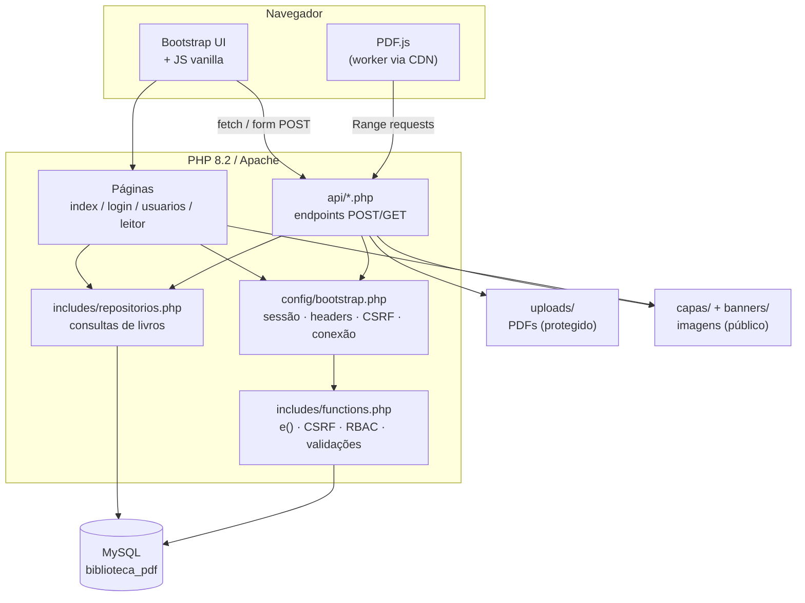
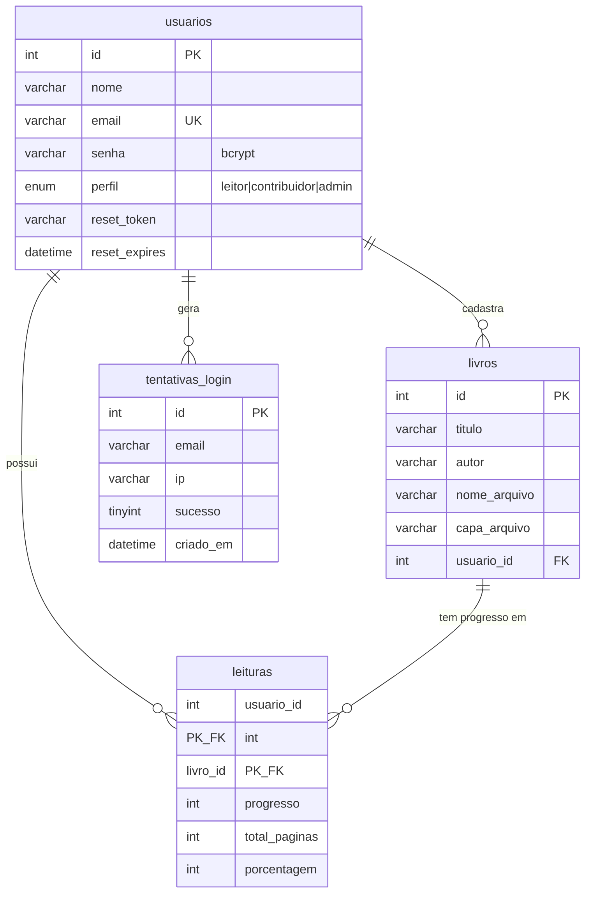

# 📚 Meus Livros

Biblioteca pessoal de PDFs — um web app responsivo para catalogar, ler e acompanhar o progresso de leitura de livros em PDF, com controle de acesso por perfil de usuário.

> Projeto em PHP puro (sem framework), feito para rodar sobre XAMPP ou qualquer Apache + PHP + MySQL. Este README é o guia completo: instalação, configuração do banco, publicação e execução da suíte de testes.

**O repositório contém apenas o código.** Por conterem dados pessoais, ficam de fora (via `.gitignore`) e são criados na sua instalação:

| Fora do repositório | Por quê |
|---|---|
| `.env` | Credenciais do banco — use o `.env.example` como modelo |
| `uploads/*.pdf` | Os PDFs do acervo |
| `capas/*.png` | As capas geradas a partir dos PDFs |
| `banners/*` | As imagens de banner do sistema |
| Usuários e senhas | Nenhum usuário vem no `schema.sql`; o primeiro admin é criado por você (passo 4) |

As pastas `uploads/`, `capas/` e `banners/` vêm versionadas vazias, já com os `.htaccess` que as protegem.

---

## Índice

- [Visão geral](#visão-geral)
- [Funcionalidades](#funcionalidades)
- [Stack tecnológica](#stack-tecnológica)
- [Arquitetura](#arquitetura)
- [Como rodar localmente](#como-rodar-localmente)
- [Hospedagem](#hospedagem)
- [Estrutura de pastas](#estrutura-de-pastas)
- [Modelo de dados](#modelo-de-dados)
- [Referência da API](#referência-da-api)
- [Segurança](#segurança)
- [Testes automatizados (Cypress)](#testes-automatizados-cypress)
- [Limitações conhecidas](#limitações-conhecidas)
- [Licença](#licença)

---

## Visão geral

**Meus Livros** resolve um problema simples: uma coleção grande de PDFs espalhados em pastas, sem forma de acompanhar o que já foi lido. O sistema centraliza os arquivos, gera capas automaticamente a partir da primeira página de cada PDF, e oferece um leitor embutido que lembra exatamente onde cada usuário parou — de forma independente por pessoa, já que o acervo pode ser compartilhado entre várias contas com níveis de acesso diferentes.

- **Multiusuário com três perfis**: leitor, contribuidor e administrador, cada um com um conjunto distinto de permissões.
- **100% responsivo**: a mesma interface funciona em desktop, tablet e celular, incluindo o leitor de PDF (com gestos de swipe no mobile).
- **Sem dependência de serviços externos para funcionar**: as únicas chamadas de rede saem para CDNs de bibliotecas front-end (Bootstrap, Font Awesome, PDF.js) — todo o resto roda localmente.

---

## Funcionalidades

| Área | O que faz |
|---|---|
| **Catálogo de livros** | Upload de PDF com geração automática de capa (renderizada no navegador a partir da 1ª página), edição de título/autor, exclusão com limpeza dos arquivos físicos |
| **Busca e navegação** | Busca em tempo real (server-side, sobre todo o acervo) com debounce; ordenação por mais recentes, mais antigos, A-Z e Z-A; paginação |
| **Leitor de PDF integrado** | Renderização página a página com PDF.js, zoom (0.4×–3.0×), tela cheia, navegação por teclado/scroll/swipe, carregamento em streaming (HTTP Range requests) para arquivos grandes |
| **Progresso de leitura por usuário** | Cada usuário tem seu próprio marcador de página em cada livro — dois leitores do mesmo PDF não sobrescrevem o progresso um do outro |
| **Autenticação e controle de acesso** | Login com hash bcrypt, três perfis de RBAC, recuperação de senha por token de uso único, troca de senha autenticada |
| **Gestão de usuários** (admin) | Criar, listar e remover usuários; redefinir senha de terceiros; proteção contra auto-exclusão |
| **Banners personalizáveis** (admin) | Banner horizontal (mobile/tablet) e vertical (desktop), com regra de visibilidade por perfil |
| **Segurança de aplicação web** | CSRF em todas as ações de escrita, XSS mitigado por escaping consistente, rate limiting de login, validação de upload por assinatura real de arquivo (não só extensão), CSP, cookies de sessão endurecidos |

---

## Stack tecnológica

| Camada | Tecnologia |
|---|---|
| Backend | PHP 8.2 (procedural, sem framework — PDO para acesso a dados) |
| Banco de dados | MySQL / MariaDB |
| Frontend | Bootstrap 5.3, Font Awesome 6, JavaScript vanilla (sem build step) |
| Renderização de PDF | [PDF.js](https://mozilla.github.io/pdf.js/) 2.16 |
| Servidor local | Apache (via XAMPP) |

Não há dependências de build (webpack/vite/npm) — o front-end é servido como está, sem etapa de compilação. O único gerenciamento de dependências é via CDN (ver [Segurança](#segurança) sobre a Content-Security-Policy que restringe quais CDNs são permitidos).

---

## Arquitetura



### Decisões de arquitetura

- **Sem framework, com convenções próprias.** O projeto é PHP procedural organizado por convenção: um bootstrap único (`config/bootstrap.php`) resolve sessão, headers de segurança, CSRF e conexão de banco para toda página/endpoint, evitando a duplicação de lógica de autenticação que existiria sem ele.
- **PDFs nunca ficam publicamente acessíveis.** A pasta `uploads/` é bloqueada por `.htaccess`; todo PDF é servido por `api/download.php`, que exige sessão autenticada e implementa HTTP Range requests para permitir streaming (importante para arquivos grandes).
- **Capas e banners são conteúdo público de baixa sensibilidade** e ficam em pastas servidas diretamente pelo Apache (`capas/`, `banners/`), com execução de PHP desabilitada nelas por precaução.
- **Busca no servidor, não no DOM.** A busca consulta o banco (`LIKE`) e devolve HTML pronto via AJAX — versões anteriores filtravam apenas os itens já renderizados na tela, o que limitava a busca à página atual.

---

## Como rodar localmente

### Pré-requisitos

- [XAMPP](https://www.apachefriends.org/) (ou Apache + PHP 8.2+ + MySQL/MariaDB avulsos)
- Extensões PHP: `pdo_mysql`, `fileinfo`, `mbstring`, `openssl` (todas vêm habilitadas por padrão no XAMPP)
- [Node.js](https://nodejs.org/) 18+ — **apenas** para rodar a suíte de testes; a aplicação em si não precisa dele

### Passo a passo

1. **Clone o repositório** dentro da pasta `htdocs` do XAMPP (ou na raiz web do seu servidor):
   ```bash
   git clone https://github.com/ariceliomouradev/ebook-v2.git meus_livros
   cd meus_livros
   ```
   O nome da pasta define a URL da aplicação (`http://localhost/meus_livros/`) e é
   usado no passo 3 — se você usar outro nome, ajuste `APP_URL` de acordo.

2. **Crie o banco de dados** e aplique o schema:
   ```bash
   mysql -u root -e "CREATE DATABASE biblioteca_pdf CHARACTER SET utf8mb4 COLLATE utf8mb4_general_ci;"
   mysql -u root biblioteca_pdf < database/schema.sql
   ```

3. **Configure as variáveis de ambiente** copiando o modelo:
   ```bash
   cp .env.example .env
   ```
   Edite `.env` com as credenciais do seu MySQL e a URL da instalação:
   ```ini
   DB_HOST=localhost
   DB_NAME=biblioteca_pdf
   DB_USER=root
   DB_PASS=
   DB_CHARSET=utf8mb4

   APP_ENV=local
   APP_DEBUG=true

   APP_URL=http://localhost/meus_livros/
   ```

4. **Crie o primeiro usuário administrador** diretamente no banco (não há tela de "primeiro acesso"):
   ```bash
   php -r "echo password_hash('SuaSenhaForte@123', PASSWORD_DEFAULT);"
   ```
   ```sql
   INSERT INTO usuarios (nome, email, senha, perfil)
   VALUES ('Seu Nome', 'seu@email.com', '<hash gerado acima>', 'admin');
   ```

5. **Garanta que o PHP pode escrever** em `uploads/`, `capas/` e `banners/` — é onde
   os PDFs, as capas geradas e os banners são gravados. No Windows/XAMPP isso já
   funciona por padrão; em Linux:
   ```bash
   sudo chown -R www-data:www-data uploads capas banners
   sudo chmod -R 775 uploads capas banners
   ```

6. **Confirme que o Apache lê os `.htaccess`** do projeto (eles bloqueiam o acesso
   direto aos PDFs, ao `.env` e às pastas de código). É preciso ter o
   `mod_rewrite`/`AllowOverride All` habilitado — no XAMPP já vem assim. Para testar,
   abra `http://localhost/meus_livros/.env`: a resposta correta é **403 Forbidden**.

7. **Acesse pelo navegador** e entre com o usuário criado no passo 4:
   ```
   http://localhost/meus_livros/login.php
   ```

### Variáveis de ambiente

| Variável | Descrição | Padrão |
|---|---|---|
| `DB_HOST` | Host do MySQL | `localhost` |
| `DB_NAME` | Nome do banco | `biblioteca_pdf` |
| `DB_USER` | Usuário do banco | `root` |
| `DB_PASS` | Senha do banco | *(vazia)* |
| `DB_CHARSET` | Charset da conexão | `utf8mb4` |
| `APP_ENV` | Ambiente (`local`, `production`) | `local` |
| `APP_DEBUG` | Exibe erros PHP na tela quando `true` — **deixe `false` fora de ambiente local** | `true` |
| `APP_URL` | URL onde a aplicação responde; usada pela suíte Cypress como `baseUrl` | `http://localhost/meus_livros/` |

> ⚠️ `.env` nunca deve ser commitado — está no `.gitignore`. Um usuário MySQL dedicado (não `root`) com privilégios mínimos é recomendado fora de ambiente de desenvolvimento.

---

## Hospedagem

O projeto roda em qualquer hospedagem com Apache + PHP 8.2 + MySQL (compartilhada
ou VPS). Não há etapa de build: envie os arquivos, crie o banco e configure o `.env`.

1. Suba os arquivos para a pasta pública (`public_html`, `www` ou equivalente) — **sem**
   `node_modules/` e **sem** `cypress/`, que só servem para desenvolvimento.
2. Crie o banco pelo painel da hospedagem (ou phpMyAdmin) e importe `database/schema.sql`.
3. Crie o `.env` no servidor a partir do `.env.example`, com o usuário de banco da
   hospedagem e:
   ```ini
   APP_ENV=production
   APP_DEBUG=false
   APP_URL=https://seu-dominio.com/
   ```
4. Crie o primeiro admin (passo 4 da instalação local, executando o `INSERT` pelo
   phpMyAdmin).
5. Confira que os `.htaccess` estão sendo aplicados (`AllowOverride All`): acessar
   `https://seu-dominio.com/.env` precisa devolver **403**, e um PDF em
   `https://seu-dominio.com/uploads/arquivo.pdf` também.

**Recomendações para produção:**

- Use **HTTPS**. Com TLS ativo o cookie de sessão passa a ser marcado como `Secure`
  automaticamente (`config/bootstrap.php`).
- Crie um usuário MySQL dedicado com privilégios mínimos (`SELECT`, `INSERT`,
  `UPDATE`, `DELETE` no banco da aplicação) — não use `root`.
- Ajuste `upload_max_filesize` e `post_max_size` no PHP para o tamanho máximo de PDF
  desejado (o limite da aplicação é 100 MB, definido em `config/app.php`).
- A recuperação de senha usa a função `mail()` do PHP. Em hospedagem sem SMTP
  configurado o envio falha e o link é gravado no log de erro do PHP — configure um
  SMTP se o fluxo de "esqueci minha senha" for necessário.
- Faça backup de `uploads/`, `capas/` e do banco: são os dados que não estão no
  repositório.

---

## Estrutura de pastas

```
meus_livros/
├── api/            # Endpoints (auth, CRUD de livros, usuários, senha, banners, download, progresso)
├── assets/         # CSS e JavaScript (sem build step)
├── banners/        # Imagens de banner (público, sem execução de PHP)
├── capas/          # Capas de livros geradas no upload (público, sem execução de PHP)
├── components/     # Partials PHP incluídos pelas páginas (acesso direto bloqueado)
├── config/         # Bootstrap, conexão de banco, variáveis de ambiente (acesso direto bloqueado)
├── database/       # schema.sql e migrações versionadas (acesso direto bloqueado)
├── includes/       # Funções compartilhadas: escaping, CSRF, RBAC, repositórios de dados (acesso direto bloqueado)
├── cypress/        # Suíte de testes E2E (specs, comandos, fixtures) — não vai para produção
├── uploads/        # PDFs (acesso direto bloqueado — servidos só via api/download.php)
├── views/          # Leitor de PDF
├── .env.example    # Modelo de configuração
├── cypress.config.js  # Configuração do Cypress e tasks de banco dos testes
├── package.json    # Dependências de desenvolvimento (Cypress, driver MySQL)
├── index.php       # Dashboard principal
├── login.php
├── logout.php
├── redefinir_senha.php
└── usuarios.php    # Gestão de usuários (admin)
```

Cada pasta de código (`config/`, `includes/`, `database/`, `components/`) tem um
`.htaccess` que bloqueia acesso direto pelo navegador — o conteúdo delas só é
alcançado via `include` do PHP.

---

## Modelo de dados



Schema completo, com todas as colunas, chaves e constraints, em
[`database/schema.sql`](database/schema.sql). Para bancos criados na versão anterior,
[`database/migracao_v1.1.sql`](database/migracao_v1.1.sql) aplica as tabelas novas e
migra o progresso de leitura.

---

## Referência da API

Todos os endpoints exigem sessão autenticada (exceto login e recuperação de senha) e token CSRF em toda requisição de escrita — enviado como campo `csrf_token` em formulários ou header `X-CSRF-Token` em chamadas `fetch`.

| Endpoint | Método | Perfil mínimo | Descrição |
|---|---|---|---|
| `POST /api/auth.php` | POST | público | Login (com rate limiting) |
| `POST /api/upload.php` | POST | contribuidor | Cadastra um novo livro |
| `POST /api/editar.php` | POST | admin | Edita título/autor de um livro |
| `POST /api/excluir.php` | POST | admin | Remove um livro e seus arquivos |
| `GET /api/download.php?id=` | GET | leitor | Entrega o PDF (com suporte a `Range`) |
| `GET /api/buscar.php` | GET | leitor | Busca/pagina livros via AJAX |
| `POST /api/progresso.php?id=` | POST | leitor | Salva o progresso de leitura do usuário atual |
| `POST /api/manage_banners.php` | POST | admin | Upload/remoção de banners |
| `POST /api/mudar_senha.php` | POST | leitor | Troca a própria senha |
| `POST /api/solicitar_reset.php` | POST | público | Solicita link de redefinição de senha |
| `POST /api/salvar_nova_senha.php` | POST | público (token) | Confirma nova senha via token |
| `POST /api/usuario_add.php` | POST | admin | Cria um usuário |
| `POST /api/usuario_excluir.php` | POST | admin | Remove um usuário |
| `POST /api/usuario_reset_senha.php` | POST | admin | Redefine a senha de outro usuário |

Endpoints que respondem a chamadas `fetch` devolvem JSON (`{ success, ... }`) com o
status HTTP correspondente — `400` para CSRF inválido, `403` para perfil sem
permissão, `422` para dados inválidos. Endpoints acionados por formulário redirecionam
para a página de origem com um parâmetro `msg=` que dispara o modal de feedback.
O contrato de cada um está coberto pelos testes em `cypress/e2e/`.

---

## Segurança

Práticas aplicadas em toda a base de código:

- **CSRF** — token de sessão validado em toda ação de escrita.
- **XSS** — toda saída passa por escaping (`htmlspecialchars`); nenhuma interatividade depende de atributos `onclick` inline, o que permite uma Content-Security-Policy restritiva (definida em `config/bootstrap.php`, sem `'unsafe-inline'` em `script-src`).
- **Autenticação** — senhas com `password_hash`/`password_verify` (bcrypt), regeneração de ID de sessão no login e após troca de senha, cookies `HttpOnly` + `SameSite`, timeout de inatividade.
- **Upload** — arquivos validados pela assinatura real (magic number / MIME via `finfo`), não apenas pela extensão.
- **Rate limiting** — tentativas de login malsucedidas são limitadas por e-mail e IP.
- **Anti-enumeração** — a recuperação de senha responde de forma idêntica exista ou não o e-mail cadastrado.
- **Superfície de arquivos** — PDFs nunca são servidos diretamente; pastas de configuração e código de suporte (`config/`, `includes/`, `database/`, `components/`) são bloqueadas por `.htaccess`.

Se você encontrar uma vulnerabilidade, por favor não abra uma issue pública: entre em
contato em privado pelo perfil do GitHub do autor.

---

## Testes automatizados (Cypress)

O repositório inclui uma suíte de regressão ponta a ponta com **220 testes** cobrindo
os fluxos dos três perfis, o controle de acesso, a experiência de uso e a
responsividade. A interface é instrumentada com 157 atributos `data-testid`, então os
testes não dependem de classes CSS nem da estrutura do HTML.

### Como rodar

```bash
npm install          # Cypress + driver MySQL (só para desenvolvimento)
npm run fixtures     # gera os arquivos de teste (PDF de 3 páginas, PNGs, TXT inválido)
npm run test:e2e     # roda a suíte inteira em modo headless (~7 min)
```

| Comando | O que faz |
|---|---|
| `npm run test:e2e` | Suíte completa, headless |
| `npm run test:e2e:open` | Abre a interface gráfica do Cypress |
| `npm run test:auth` | Só autenticação |
| `npm run test:rbac` | Só controle de acesso |
| `npm run test:responsivo` | Só responsividade |
| `npm run test:limpar` | Apaga toda a massa de teste do banco |

A URL usada nos testes vem do `APP_URL` do `.env` — não é preciso editar
`cypress.config.js`. As credenciais do banco também são lidas de lá.

### Cobertura

| Spec | Testes | O que cobre |
|---|:---:|---|
| `01-autenticacao` | 21 | Login dos três perfis, mensagens genéricas de erro (sem enumeração de contas), CSRF, rate limiting, proteção de rota, logout, cabeçalhos de segurança |
| `02-rbac` | 40 | Matriz de permissões verificada na interface **e** nos endpoints (403/302); CSRF; arquivos e pastas protegidos |
| `03-biblioteca` | 24 | Busca server-side com debounce, estados vazios, as quatro ordenações conferidas contra o banco, paginação por AJAX, toast de falha |
| `04-livros-crud` | 15 | Upload com capa gerada pelo PDF.js, rejeição de arquivo que não é PDF, edição, exclusão com limpeza de disco, banners |
| `05-leitor-pdf` | 22 | Range requests, navegação, zoom e seus limites, progresso por usuário gravado no banco, rótulos acessíveis do HUD |
| `06-usuarios-admin` | 14 | Cadastro (com login efetivo do usuário criado), senha fraca no cliente e no servidor, e-mail duplicado, reset de terceiro, bloqueio da auto-exclusão |
| `07-senhas` | 13 | Troca da própria senha e fluxo completo de recuperação por token (uso único, expiração, reutilização) |
| `08-responsividade` | 48 | 375 / 768 / 1024 / 1440 px: colunas da grade, banner × sidebar, ausência de rolagem horizontal, alvos de toque, modais, escala do leitor e swipe |
| `09-ux-acessibilidade` | 23 | Console sem erros (inclusive CSP no leitor), títulos e idioma, textos alternativos, loader e toasts, modais, teclado, tema escuro |

### Os testes não tocam nos seus dados

A suíte cria a própria massa e só mexe nela:

| Recurso | Proteção |
|---|---|
| Usuários | Só cria/edita/apaga e-mails terminados em `@e2e.test` |
| Livros | Só cria/edita/apaga títulos que começam com `[E2E]` |
| Arquivos | Só apaga os arquivos apontados pelas linhas `[E2E]`, sempre dentro de `uploads/` e `capas/` |
| Banners | São globais: os seus são copiados antes e restaurados byte a byte depois |
| Tentativas de login | Só remove as linhas dos e-mails `@e2e.test`, para não deixar o IP bloqueado |

As regras são impostas no `cypress.config.js`: a task de banco **recusa** qualquer
`INSERT`/`UPDATE`/`DELETE` que não declare um desses marcadores e bloqueia
`DROP`/`TRUNCATE`/`ALTER` incondicionalmente.

Usuários de teste (senha `Senha@E2E1`, definida em `cypress/support/dados.js`):
`admin@e2e.test`, `contribuidor@e2e.test` e `leitor@e2e.test`.

### Resultado atual

**218 de 220 testes passam.** As duas falhas restantes não são instabilidade da
suíte — cada uma trava um defeito real, descrito em [Limitações conhecidas](#limitações-conhecidas).

---

## Limitações conhecidas

Dois defeitos estão travados por testes que falham de propósito — a suíte fica
verde de novo quando forem corrigidos:

- **Token de recuperação de senha dura mais de 1 hora quando os fusos divergem.**
  `api/solicitar_reset.php` grava `reset_expires` com o relógio do **PHP**, mas a
  validação (`reset_expires > NOW()`) usa o relógio do **MySQL**. Se o
  `date.timezone` do `php.ini` estiver diferente do fuso do servidor de banco, a
  janela real de validade deixa de ser a especificada. Correção: alinhar
  `date.timezone` ao fuso do banco, ou calcular a expiração em SQL
  (`DATE_ADD(NOW(), INTERVAL 1 HOUR)`).
- **Página cortada no leitor em telas de celular.** Com a escala inicial fixa de
  0.8, uma página A4 é renderizada com 476 px de largura contra os 375 px do
  viewport, e `#canvas-container` usa `overflow-x: hidden` — cerca de 27% da largura
  fica inacessível. Correção: calcular a escala a partir da largura real do viewport,
  em vez de degraus fixos, ou permitir rolagem horizontal no container.

Escolhas de escopo (não são defeitos):

- Exclusão de livros e usuários é imediata e irreversível (não há lixeira).
- O leitor renderiza o PDF apenas em `<canvas>` — não há seleção, cópia ou busca de
  texto dentro do documento.
- Apenas tema escuro.
- Sem log de auditoria de ações administrativas.
- Não há tela de cadastro público: novos usuários são criados por um administrador.
- Os botões de ação do gerenciador medem 31 px de altura no celular — utilizáveis,
  mas abaixo dos 44 px recomendados pela WCAG 2.5.5.

---

## Licença

Distribuído sob a [Licença MIT](LICENSE) — você pode usar, modificar e redistribuir
o código, inclusive comercialmente, mantendo o aviso de copyright.
